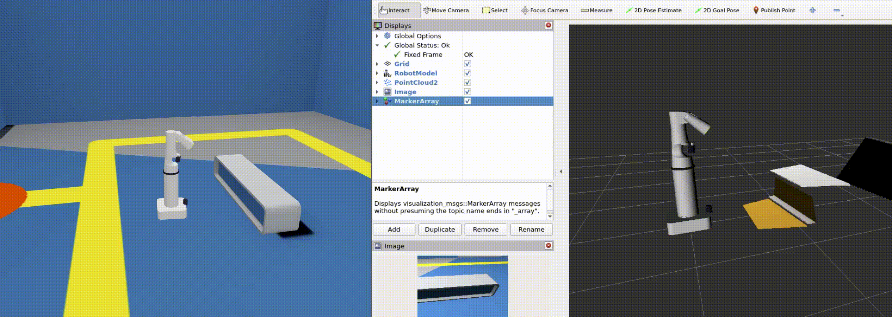
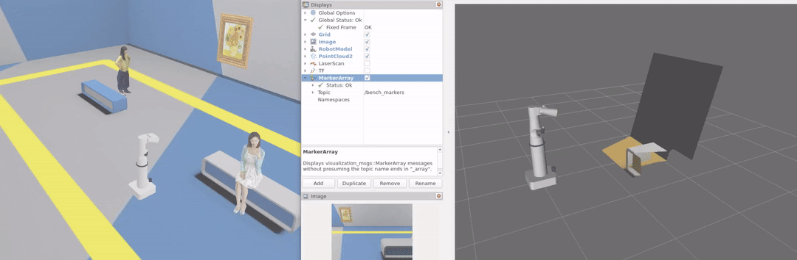

Project Name: Autonomous Perception and Navigation System

Project Overview

This project integrates advanced computer vision techniques and sensor processing to create an autonomous perception and navigation system. The system is designed to enable robots to detect and track objects, surfaces, lines, and paths, providing robust solutions for autonomous navigation in dynamic environments. The core of the system is based on real-time processing of camera feeds, point clouds, and sensor data to ensure smooth path following and obstacle avoidance.

Main Capabilities
Object Detection: Detects and tracks objects using color, facial, and eye detection algorithms.
Path Following: Follows specific lines, surfaces, or doors in real time, ensuring autonomous movement.
Blob and Point Tracking: Identifies and tracks blobs, allowing for object or target pursuit.
Surface Detection: Processes surfaces to determine boundaries and safe navigation areas.
Point Cloud and Marker Processing: Marks and processes 3D points for enhanced object tracking and positioning.
Features and Modules

1. Color Detection
Detect and mark objects based on color segmentation.

color_detector.py

2. Point Cloud Marker
Mark and track points using 3D LiDAR or depth sensors.

point_cloud_marker.py

3. Blob Tracking and Publishing
Track moving blobs in real time and publish their positions for further processing.

blob_tracker.py
blob_point_pub.py

4. Line Following
Detect and follow colored lines on the ground for autonomous navigation.

follow_yellow_line.py
follow_yellow_line_optimized.py

5. Door Following
Navigate towards and follow doors or passageways.

follow_door.py

6. Object Detection
Detect various objects in real time using camera feeds.

object_detection.py

7. Static Transform Publisher
Publishes static transforms to help align sensors or coordinate systems in a fixed setup.

static_transform_publisher.py

8. Surface Detection
Identify safe surfaces for navigation and path planning.

surface_detection.py

9. Facial and Eye Detection
Use real-time camera feeds to detect human faces and eyes for object or interaction tracking.

face_detection.py

eye_detection.py

